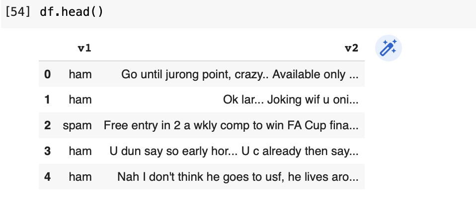
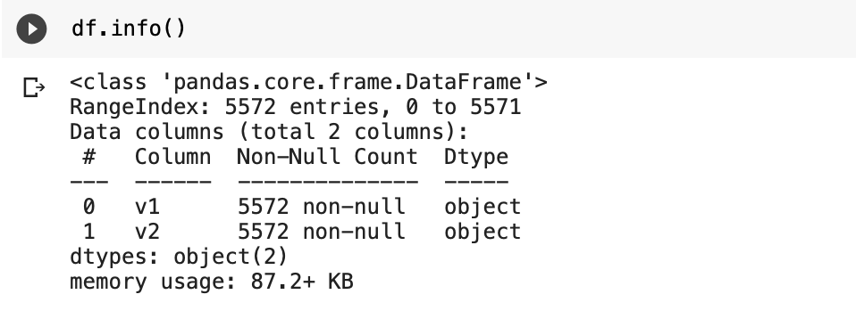
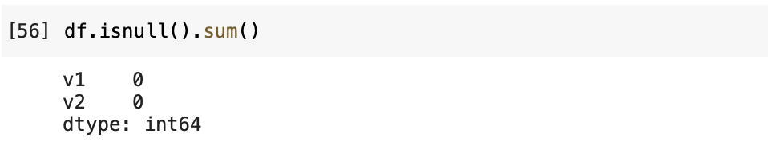
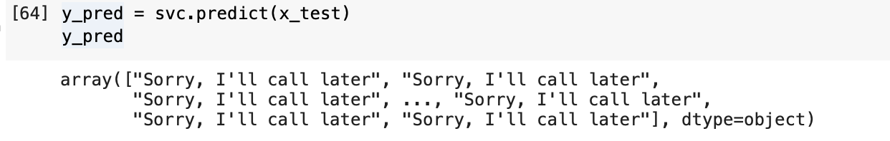
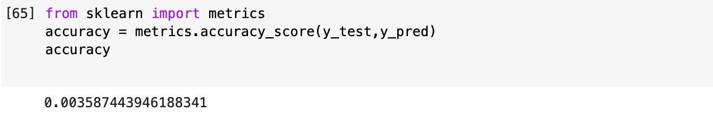

# Implementation-of-SVM-For-Spam-Mail-Detection

## AIM:
To write a program to implement the SVM For Spam Mail Detection.

## Equipments Required:
1. Hardware – PCs
2. Anaconda – Python 3.7 Installation / Moodle-Code Runner

## Algorithm
1.Import the required packages.
Import the dataset to operate on.
Split the dataset.
Predict the required output.
End the program. 
 
 
 

## Program:
~~~
/*
Program to implement the SVM For Spam Mail Detection..
Developed by:Umar Mohamed E 
RegisterNumber:212220040173  
*/
import pandas as pd
import matplotlib.pyplot as plt

data = pd.read_csv('/content/Spam.csv',encoding='latin-1')
df = data.drop(['Unnamed: 2','Unnamed: 3','Unnamed: 4'],axis=1)

df.head()

df.info()

df.isnull().sum()

x=df["v1"].values
y=df["v2"].values

from sklearn.model_selection import train_test_split
x_train,x_test,y_train,y_test = train_test_split(x,y,test_size = 0.2,random_state=0)

from sklearn.feature_extraction.text import CountVectorizer
cv = CountVectorizer()

x_train=cv.fit_transform(x_train)
x_test = cv.transform(x_test)

from sklearn.svm import SVC
svc = SVC()
svc.fit(x_train,y_train)

y_pred = svc.predict(x_test)
y_pred

from sklearn import metrics
accuracy = metrics.accuracy_score(y_test,y_pred)
accuracy

~~~

## Output:

## Result:
Thus the program to implement the SVM For Spam Mail Detection is written and verified using python programming.
